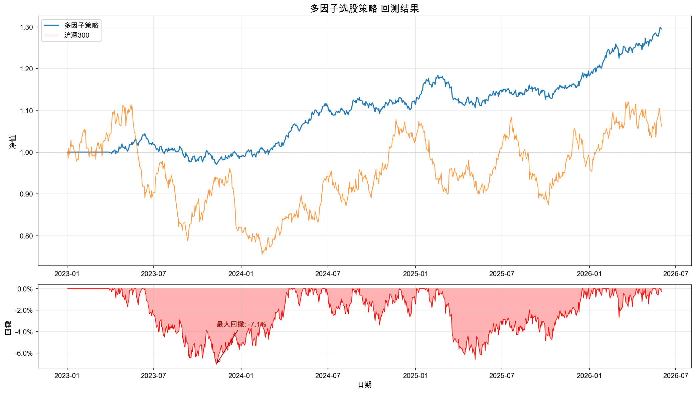
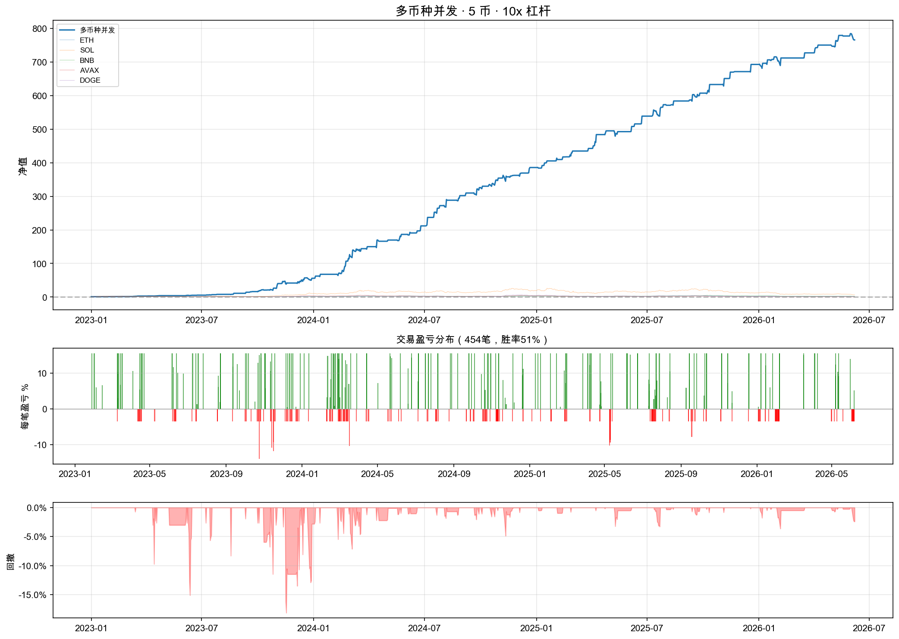

# 🔬 量化交易系统 | 回测 → 实盘 → 真金白银验证

[](https://www.python.org/)
[](LICENSE)

一个从回测到实盘的完整量化交易项目，覆盖 **A 股多因子选股** 和 **加密货币期货策略**。

**亮点：加密货币 RSI 策略已在实盘运行，9 笔交易净利 +$31，盈亏比 3:1。**

---

## 🚀 实盘机器人（Bitget 永续合约）

真金白银在跑的 RSI 均值回归策略，部署于阿里云香港服务器，24×7 运行。

### 策略逻辑

```
RSI(5) < 20 + 放量(>1.5x) + 影线确认 → 市价做多
RSI(5) > 82 + 放量(>1.5x) + 影线确认 → 市价做空
止盈 +2.5%  |  止损 -0.6%  |  盈亏比 4.2:1
浮动止盈：浮盈达标后止损线跟随，回撤 0.3% 平仓
```

### 实盘战绩（2026.06.10 – 至今）

| 指标 | 全部 | 正常交易 |
|------|------|------|
| 交易笔数 | 59 | 16 |
| 胜率 | — | 44% |
| 盈亏比 | — | **~3 : 1** |
| 净利 | ~-$13 | **~+$23** |

> ⚠️ 06/14-15 发生精度 bug 导致 43 笔无效交易，已修复。详见 [Bug 复盘](docs/bug-report-20260615.md)

> 📊 详细记录见 [LIVE_TRADING.md](LIVE_TRADING.md)

### 风控设计

| 机制 | 说明 |
|------|------|
| 每日亏损上限 | 亏 20% 自动停机 |
| 连续失败保护 | 连续 3 次开仓失败停机 |
| 紧急平仓 | TP/SL 挂单失败立即市价平仓 |
| 限价单保护 | 60 秒未成交撤单，绝不裸仓 |
| 最大持仓 | 最多 3 个币种同时持仓 |

### 运行方式

```bash
# 模拟盘（不实际交易，用 yfinance 模拟数据）
python bitget_bot.py --dry-run

# 实盘（需要设置环境变量）
export BITGET_KEY="your_api_key"
export BITGET_SECRET="your_api_secret"
export BITGET_PASSPHRASE="your_passphrase"
python bitget_bot.py --live
```

---

## 📈 A 股多因子选股回测

沪深 300 成分股，月度调仓，6 因子等权打分。

| 因子 | 方向 | 说明 |
|------|------|------|
| 20日动量 | + | 追趋势 |
| 20日波动率 | − | 偏好低波 |
| 20日换手率 | − | 避开投机股 |
| 5日量比 | + | 资金关注 |
| 14日RSI | − | 不过热 |
| 规模因子 | − | 小盘溢价 |

- 交易成本 0.35%（含印花税、佣金、滑点）
- 基准：沪深300
- 数据源：AkShare



---

## 🪙 加密货币策略研究

| 策略 | 文件 | 思路 | 周期 |
|------|------|------|------|
| 动量趋势 | `crypto_momentum.py` | MA50 趋势跟踪 + 动量排序 | 日线 |
| 超短线 | `crypto_short_term.py` | RSI + 布林带 | 15分钟 |
| 高频剥头皮 | `crypto_scalping.py` | 插针反转 + 成交量确认 | 5分钟 |
| 多币种并发 | `crypto_multi.py` | 5币并发 + 动态杠杆 | 小时线 |



---

## 📁 项目结构

```
quant_backtest/
├── README.md               ← 你在这
├── LIVE_TRADING.md          ← 实盘交易记录
├── requirements.txt         ← Python 依赖
│
├── bitget_bot.py            ← 🚀 实盘机器人（Bitget API）
├── main.py                  ← A股回测入口
├── config.py                ← 全局参数
│
├── backtest.py              ← 回测引擎
├── data_loader.py           ← 数据获取（AkShare/yfinance）
├── factors.py               ← 因子计算 + 截面标准化
├── analysis.py              ← 绩效分析 + 可视化
│
├── backtest_200.py          ← 200只股票回测
├── backtest_5m.py           ← 5分钟周期回测
├── backtest_hourly.py       ← 小时级回测
├── backtest_current.py      ← 最新参数回测
│
├── crypto_momentum.py       ← 币圈动量策略
├── crypto_short_term.py     ← 币圈超短线
├── crypto_scalping.py       ← 币圈剥头皮
├── crypto_multi.py          ← 多币种并发
├── analyze_wicks.py         ← 插针分析
│
├── assets/                  ← 回测图表 & 数据
└── cache/                   ← 本地数据缓存
```

---

## ⚡ 快速开始

```bash
# 克隆
git clone https://github.com/crilicheng/quant-backtest.git
cd quant-backtest

# 安装依赖
pip install -r requirements.txt

# A 股多因子回测（快速模式，50 只股票）
python main.py --quick

# 完整回测（300 只股票）
python main.py

# 加密货币回测
python crypto_momentum.py

# 实盘模拟
python bitget_bot.py --dry-run
```

---

## 🔜 路线图

- [ ] 实盘净值曲线可视化
- [ ] 更多因子（质量、成长、一致预期）
- [ ] 行业中性化
- [ ] Barra 风险模型
- [ ] Streamlit 交互式看板
- [ ] 对接更多交易所（Binance、OKX）

---

## 👤 作者

AI 专业学生，量化方向探索中。

---

## ⚠️ 免责声明

本项目仅供学习研究，**不构成任何投资建议**。回测收益不代表未来表现，加密货币交易风险极高，可能损失全部本金。
